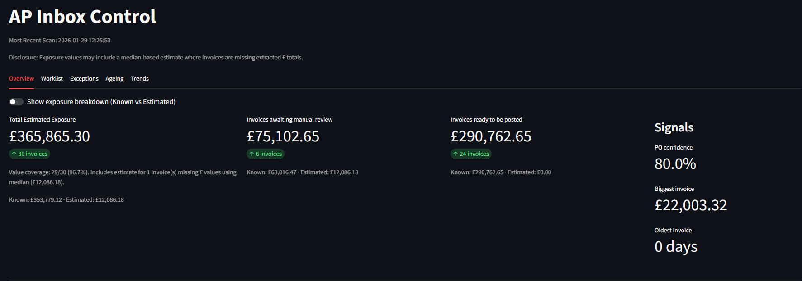
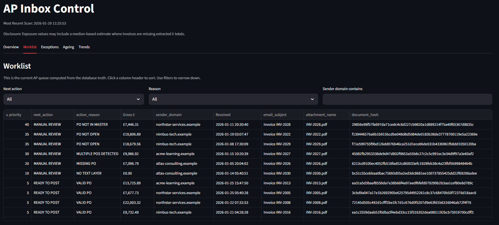

# AP Inbox Control System — Public Reference Implementation

**A deterministic Accounts Payable inbox control system that turns email chaos into a clear, auditable worklist.**

This project demonstrates how a finance function can **reduce manual firefighting in AP** by applying simple, well-structured system design — without machine learning, black boxes, or ERP customisation.

This repo is **public-safe, end-to-end reference implementation**, built to show *how AP processes can be engineered*, not just operated.

---
## Running the Demo

```bash

pip install -r requirements.txt
```
```bash

python demo_pipeline.py
```
```bash

streamlit run app.py
```
---

## Why This Exists (Context for Recruiters)

Accounts Payable teams are often overwhelmed not because invoices are complex, but because **inbox-driven workflows don’t scale**.

Typical problems:
- Invoices arrive by email with no tracking
- Duplicate invoices are hard to spot
- POs are missing, closed, or unapproved
- Exposure is unknown until month-end
- Work is prioritised by urgency, not logic

This project reframes AP as a **pipeline**, not a mailbox.

It shows how you can:
- Treat the inbox as a data source
- Derive deterministic truth from messy inputs
- Surface risk and workload clearly
- Give AP teams a single, explainable “next action” per invoice

---

## What This Demonstrates

### Business Outcomes
- Clear visibility of invoice exposure
- Early detection of PO and value issues
- Reduced manual chasing and rework
- A prioritised AP worklist instead of inbox firefighting

### Dashboard Preview

#### Overview
The Overview tab provides an at-a-glance view of total AP exposure, what can be posted immediately, and where risk or manual intervention remains.


#### Worklist
The operational AP queue, ordered by priority with deterministic next actions and explicit blockers. Useful tool for managers to quickly assess and delegate tasks.


### Technical Outcomes
- Deterministic, auditable processing (no ML / no heuristics)
- Idempotent pipelines that can be safely re-run
- Separation between ingestion, validation, and presentation
- A clean SQLite truth store powering both automation and reporting

---

## High-Level Flow

- **Inbox ingestion**  
  Synthetic inbox messages and PDF attachments are scanned and normalised into a structured data model.

- **Document fingerprinting**  
  PDF attachments are hashed deterministically to prevent duplicates and enable safe reprocessing.

- **PO detection**  
  Purchase Order references are extracted from invoices using explicit, explainable rules.

- **PO validation**  
  Detected POs are validated against a master dataset to determine posting readiness.

- **Value extraction**  
  Invoice values are extracted where possible, with conservative estimation used only when required.

- **Worklist generation**  
  Each invoice is assigned a single next action, reason, and priority based on deterministic rules.

- **Dashboard presentation**  
  A read-only dashboard surfaces exposure, ageing, exceptions, and the operational worklist.

---

## Core Features

### Inbox Scanning
- Reads a synthetic inbox definition (public-safe)
- Hashes PDF attachments to prevent duplicates
- Tracks presence across scans (what’s new / what disappeared)

### Purchase Order Detection
- Extracts PO numbers deterministically from PDFs
- Handles missing, multiple, and unreadable cases explicitly

### PO Validation
- Validates detected POs against a master dataset
- Separates detection truth from validation truth
- Produces a canonical `ready_to_post` flag

### Value Extraction
- Extracts gross / net / VAT where available
- Uses median-based estimation for missing values (clearly disclosed)
- Keeps value logic explainable and conservative

### Worklist Generation
- Produces **one next action per invoice**
- Fully precedence-based (first blocker wins)
- Every row includes an action, reason, and priority
- Designed for AP operators, not developers

### Dashboard
- Read-only, public-safe Streamlit app
- Shows exposure, ageing, exceptions, and confidence
- Surfaces the operational worklist in a sortable table

---

## Tech Stack

- **Python 3.10+**
- **SQLite** (single-file, auditable, portable)
- **Streamlit** (fast, readable dashboards)
- **pdfplumber** (deterministic PDF text extraction)

No Outlook APIs, no ERP SDKs, no tenant access.

---
## Why This Is Relevant to Engineering Roles

This project is intentionally positioned at the intersection of:

* Finance domain knowledge
* System design
* Automation thinking

It demonstrates:

* Translating messy real-world processes into clean models
* Designing pipelines instead of scripts
* Building tools for operators, not just engineers
* Thinking in terms of control, risk, and auditability

This is the kind of thinking required in:

* Internal tooling
* Fintech
* ERP / finance systems
* Operational analytics
* Platform and data engineering roles

## Disclaimer

This repository is a reference implementation and portfolio project of the product repo.

* All data is synthetic
* No real inboxes, tenants, or ERPs are accessed
* No confidential logic or credentials are included


